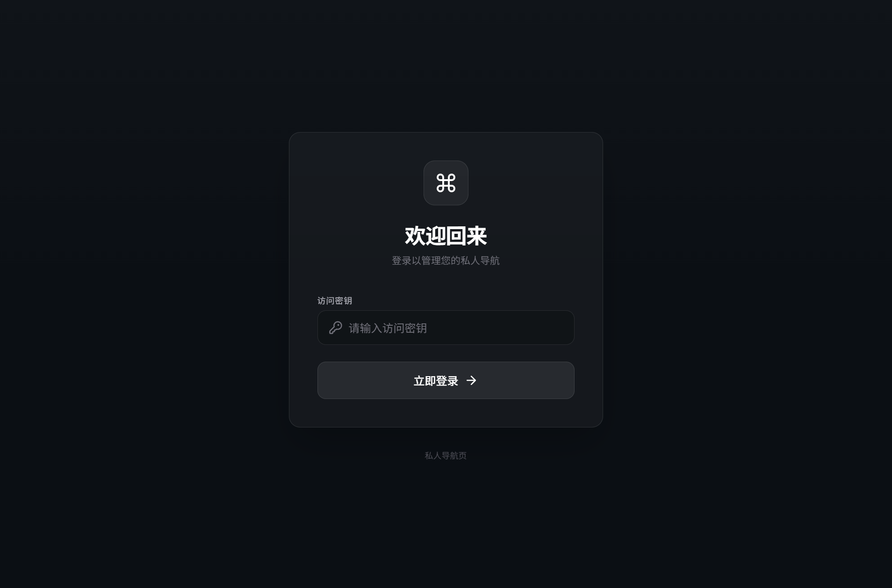
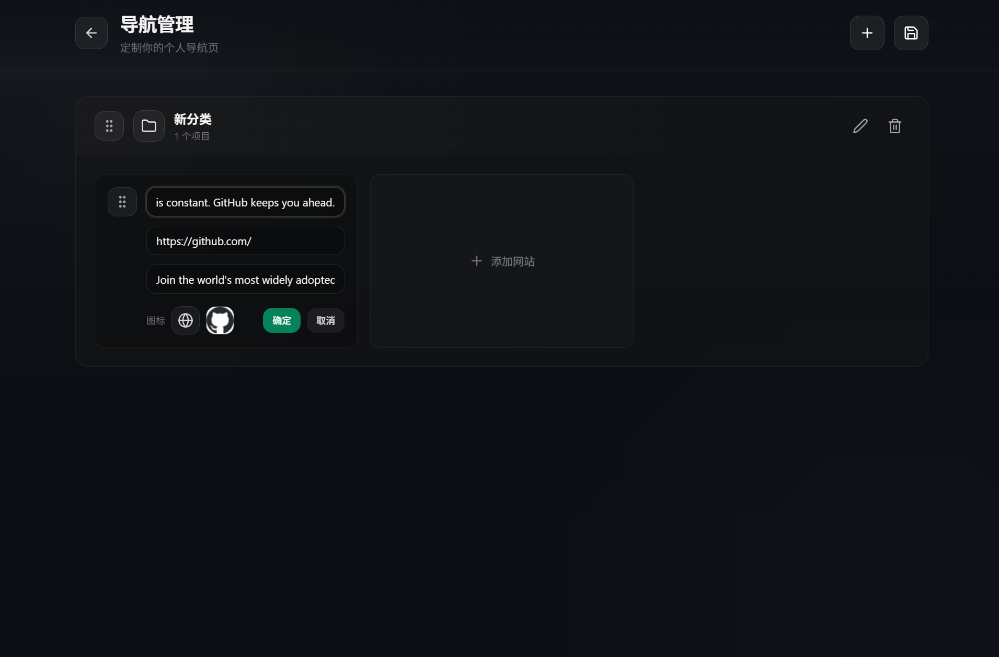
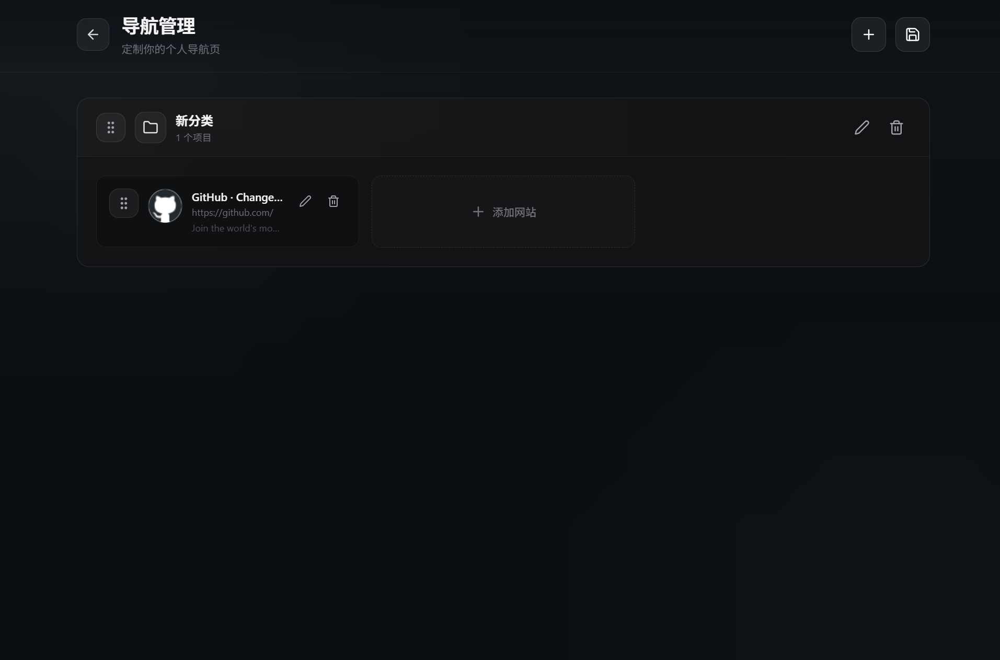

# 私人导航页

[中文说明](./README.zh-CN.md)

A secure, private, self-hosted navigation page system designed for personal use.

A full-stack navigation/portal page that supports login, navigation management, and card editing. It uses a single Node.js process to serve both the frontend build (`dist/`) and the API (`/api`).

## Features

- Secure authentication: JWT-based auth with access token and refresh token (HttpOnly cookie).
- Private access: only users with the access key can enter.
- Categorized navigation: organize links by categories.
- Search: real-time filtering of navigation links.
- Auto metadata: auto fetch title/description/favicon when editing a URL.
- JSON storage: flat-file storage without an external database.

## Screenshots

| Login | Home |
| --- | --- |
|  |  |

| Manage navigation | Edit card |
| --- | --- |
|  |  |

## Tech Stack

- Frontend: React + Vite + Tailwind CSS
- Backend: Node.js + Express
- Auth: JWT access/refresh tokens
- Storage: JSON files in `api/data/`

## Quick Start (Local Dev)

```bash
npm install
```

Create your `.env`:

```bash
cp .env.example .env
```

Set your access key in `.env`:

- `ACCESS_KEY`

Run in dev mode (frontend + API):

```bash
npm run dev
```

## Build & Run (Single Process)

```bash
npm install
npm run build
npm start
```

Default port is `PORT` in `.env` (default: 3000).

## Data & Admin

- Access key in `.env`:
  - `ACCESS_KEY`
- Data files:
  - `api/data/users.json`
  - `api/data/navigations.json`

## Health Check

- `GET /api/health` → `{"success":true,"message":"ok"}`
