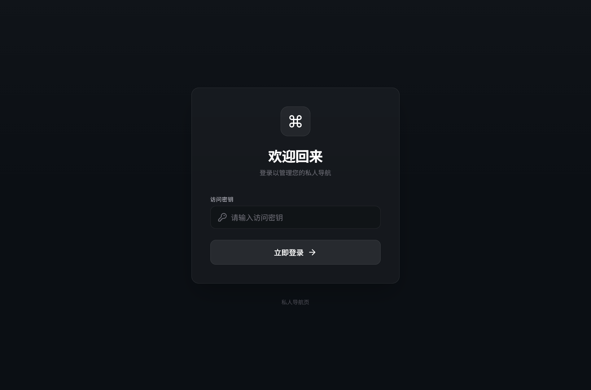
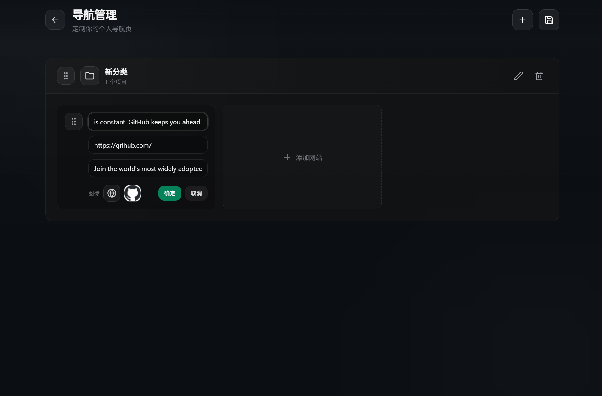
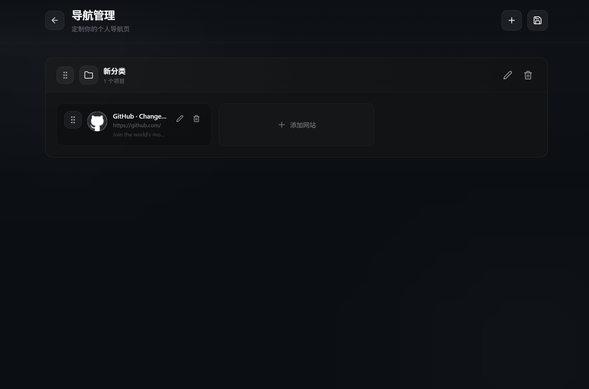

# 私人导航页

[中文说明](./README.zh-CN.md)

A secure, private, self-hosted navigation page system designed for personal use.

A full-stack navigation/portal page that supports login, navigation management, and card editing. It uses a single Node.js process to serve both the frontend build (`dist/`) and the API (`/api`).

## Features

- Secure authentication: single access-key login with JWT access and refresh tokens (HttpOnly cookie).
- Private access: only visitors with the access key can enter.
- Login protection: `/api/auth/login` has lightweight IP-based brute-force protection. 10 failed attempts within 10 minutes trigger a 10-minute block.
- Categorized navigation: organize links by categories.
- Search: real-time filtering of navigation links.
- Auto metadata: auto fetch title/description/favicon when editing a URL.
- JSON storage: flat-file storage without an external database.

## Screenshots

| Login | Home |
| --- | --- |
|  |  |

| Manage navigation | Edit card |
| --- | --- |
|  |  |

## Tech Stack

- Frontend: React + Vite + Tailwind CSS
- Backend: Node.js + Express
- Auth: JWT access/refresh tokens
- Storage: JSON files in `api/data/`

## Quick Start (Local Dev)

```bash
npm install
```

Create your `.env`:

```bash
cp .env.example .env
```

Before starting the server, replace these example values in `.env`:

- `JWT_SECRET`
- `REFRESH_TOKEN_SECRET`
- `ACCESS_KEY`

Run in dev mode (frontend + API):

```bash
npm run dev
```

## Build & Run (Single Process)

```bash
npm install
npm run build
npm start
```

Default port is `PORT` in `.env` (default: 3000).

## Deployment Notes

- The project now supports plain HTTP access and no longer forces HTTPS.
- If you deploy behind HTTPS via Nginx, the refresh cookie is still marked `Secure` automatically.
- If you deploy over plain HTTP, the refresh cookie still works without extra code changes.
- Before deployment, it is recommended to remove old `build/` and `dist/` outputs, then run `npm run build` again in the target environment.

## Files To Keep For Deployment

- Required for runtime:
  - `api/`
  - `src/`
  - `public/`
  - `scripts/`
  - `package.json`
  - `package-lock.json`
  - `tsconfig*.json`
  - `vite.config.ts`
  - `tailwind.config.js`
  - `postcss.config.js`
  - `.env`
  - `.env.example`
- Required data:
  - `api/data/navigations.json`

## Files You Can Remove Before Deployment

- Build outputs:
  - `build/`
  - `dist/`
- Test code:
  - `tests/`
  - `test-helmet.js`
- Design docs:
  - `docs/superpowers/`

## Data & Access

- Access key in `.env`:
  - `ACCESS_KEY`
- Data files:
  - `api/data/navigations.json`

## Health Check

- `GET /api/health` → `{"success":true,"message":"ok"}`
