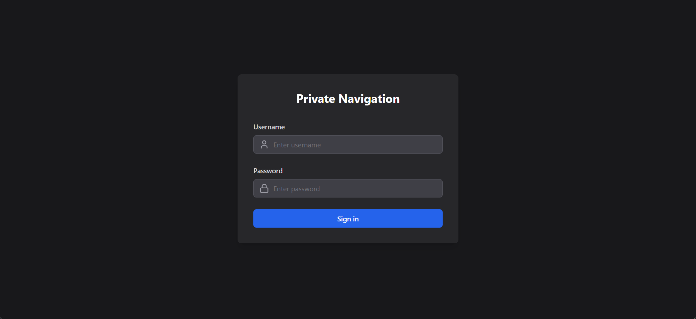
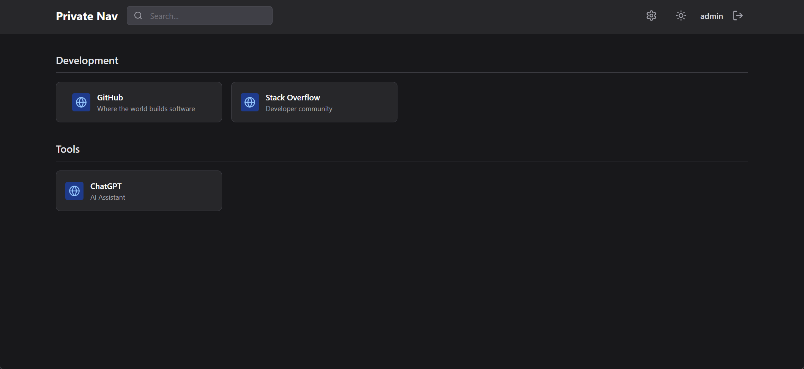
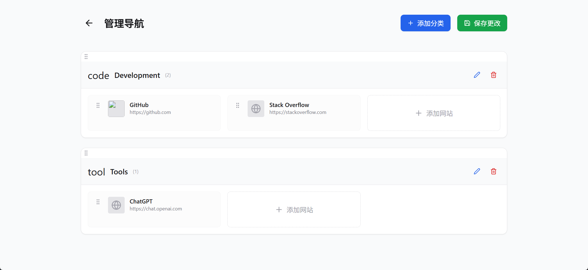
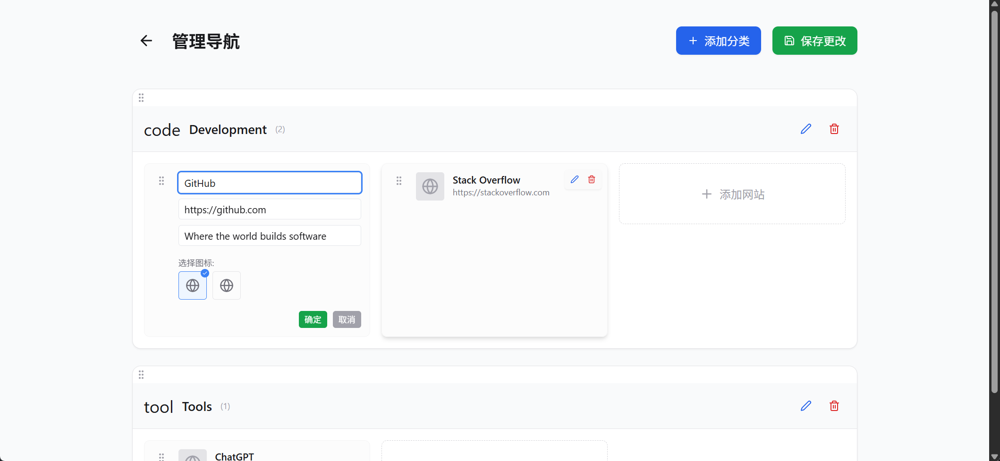

# Navigation Page

[English README](./README.md)

一个安全、私密、可自托管的个人导航页系统。

一个支持登录、导航管理与卡片编辑的全栈导航页。采用“单进程同源部署”：同一个 Node 服务同时托管前端静态资源（`dist/`）与后端 API（`/api`）。

## 项目介绍

- 安全身份验证：基于 JWT 的身份验证，使用访问令牌（内存中）和刷新令牌（HttpOnly Cookie）。
- 私密访问：只有经过身份验证的用户才能访问导航内容。
- 持久会话：刷新令牌有效期为 90 天，并可自动静默续期。
- 分类导航：按类别（开发、工具等）组织链接。
- 搜索：实时筛选导航链接。
- 深色模式：在浅色和深色主题之间切换。
- 响应式设计：针对桌面和移动设备进行了优化。
- JSON 存储：简单、便携的平面文件存储，无需外部数据库。

## 项目截图

| 登录页面 | 主页面 |
| --- | --- |
|  |  |

| 管理导航页 | 编辑卡片 |
| --- | --- |
|  |  |

## 技术栈

- 前端：React + Vite + Tailwind CSS
- 后端：Node.js + Express
- 认证：JWT（access/refresh）
- 存储：JSON 文件（`api/data/`）

## 本地开发

安装依赖：

```bash
npm install
```

创建 `.env`（二选一）：

```bash
cp .env.example .env
```

```bash
copy .env.example .env
```

启动开发模式（前端 + API）：

```bash
npm run dev
```

## 构建与启动（单进程）

```bash
npm install
npm run build
npm start
```

默认端口为 `.env` 里的 `PORT`（默认 3000）。

## 账号/密码与数据

- `.env` 里配置默认管理员：
  - `ADMIN_USERNAME`
  - `ADMIN_PASSWORD`
- 用户/导航数据文件：
  - `api/data/users.json`
  - `api/data/navigations.json`

管理员账号只会在 `users.json` 中不存在时初始化；如果已创建过管理员，改 `.env` 不会自动覆盖旧密码。

## 自检

- `GET /api/health` 返回：`{"success":true,"message":"ok"}`

## 宝塔最简配置（可选）

### 1) Node 项目启动

- 项目目录：`/www/wwwroot/navigation-page`
- 启动命令（二选一）：
  - `npm start`
  - `node build/api/server.js`
- 项目端口：3000（与 `.env` 的 `PORT` 一致）

### 2) Nginx 反向代理

让 Nginx 监听 80/443，并反代到 Node 的 3000：

```nginx
location / {
  proxy_pass http://127.0.0.1:3000;
  proxy_set_header Host $host;
  proxy_set_header X-Real-IP $remote_addr;
  proxy_set_header X-Forwarded-For $proxy_add_x_forwarded_for;
  proxy_set_header X-Forwarded-Proto $scheme;
}
```

不要让 Nginx `listen 3000;`（3000 应该只给 Node 使用），否则容易出现 `ERR_SSL_PROTOCOL_ERROR`。
